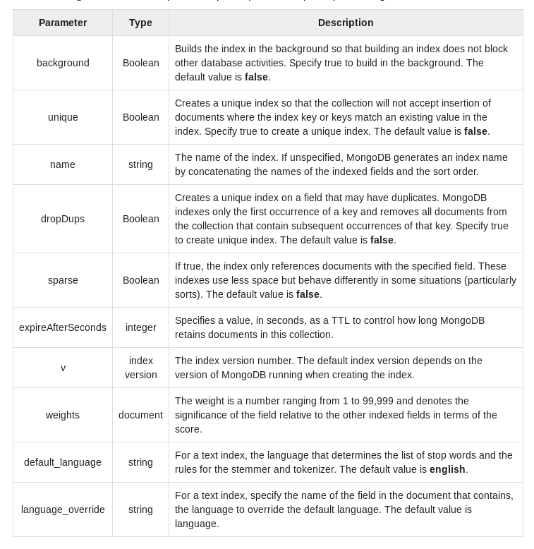
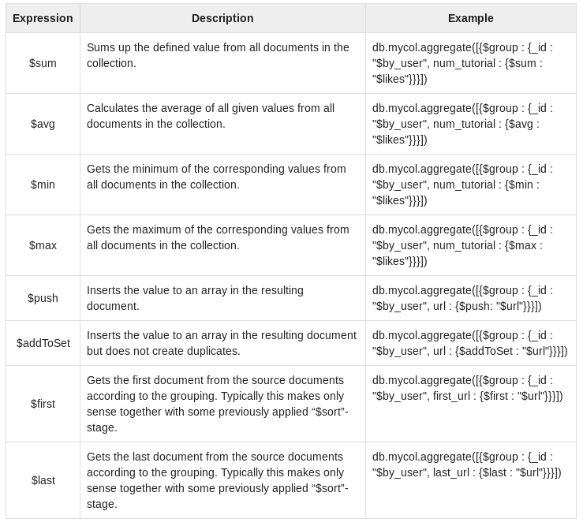

# Mongo DB
MongoDB é uma base de dados orientada a documentos representados numa estrutura JSON (internamente usa BSON, uma versão binária de JSON). É um projeto de código aberto, com licença GNU AGPL (Affero General Public License).

## Setup
Para realizar este guião optei por usar o MongoDB no docker uma vez que já tinha o mesmo instalado para um outro projeto, deste modo, para isso fiz:
```bash
$ docker pull mongo
$ docker run -p 27017:27017 --name mongodb -d mongo 
```
Após isso para me conectar mais facilmente à instância corri:
```bash
$ docker ps -a
```
E tive como output:
```
CONTAINER ID        IMAGE                 COMMAND                  CREATED             STATUS                    PORTS                      NAMES
e1a209fc9ec2        mysql/mysql-server    "/entrypoint.sh mysq…"   47 hours ago        Exited (0) 47 hours ago                              mysql1
46338965c23e        mongo:latest          "docker-entrypoint.s…"   60 days ago          Up 22 hours               0.0.0.0:32768->27017/tcp   Mongo
b3662309c7b6        portainer/portainer   "/portainer"             60 days ago          Exited (2) 47 hours ago                              naughty_roentgen
```
Após isto apenas precisei de adicionar à `.zshrc` a seguinte linha:
```bash
$ alias mongo="docker exec -it 46338965c23e /bin/bash"
```

## Conceitos
Para melhor compreender este tipo de base de dados é necessário estudar alguns conceitos como:
* Estrutura de armazenamento (DB, Collection, Documents)
* JSON e Javascript
* Escrita, Leitura, Edição, Remoção (CRUD)
* Tipos e arrays
* Índices
* Agregações e Map Reduce

### Estrutura de armazenamento
O mongo tal como as bases de dados relacionais organiza-se por "dbs", ou no caso, das relacionais, schemas.
De um modo geral podemos dizer que o `DB` é o equivalente ao `Schema` das bases de dados relacionais, as `Collections` equivalente às `Tables` e os `Documents` aos campos de cada tabela.

#### DB
Em Mongo para acedermos a uma base de dados fazemos:
```sql
use DB_NAME
```
É de notar que este comando **caso exista** a base de dados criada faz com que passemos a usar essa, **caso não exista**, cria a mesma de modo a que possa ser usada, esta criação não é persistente a não ser que sejam introduzidos dados.
```sql
show dbs
```
Ora, tomemos por exemplo:
```sql
> show dbs
admin    0.000GB
config   0.000GB
local    0.000GB
taca_ua  0.000GB
> use CBD
switched to db CBD
> show dbs
admin    0.000GB
config   0.000GB
local    0.000GB
taca_ua  0.000GB
```
Assim, podemos afirmar que apenas quando for armazenado algum registo na base de dados ela se torna persistente.

Para apagar uma base de dados podemos correr:
```shell
db.dropDatabase()
```

#### Collection
Collection são similares às tabelas do sql e sobre as quais podemos fazer consultas.
Em mongo a criação destas é automática pelo que podemos simplesmente correr:
```shell
db.movie.insert([
    {
        "name" : "Pesadelos de LEI"
    }
])
```
Após isso podemos verificar que temos uma collection criada:
```sql 
> db.movie.insert([
...     {
...         "name" : "Pesadelos de LEI"
...     }
... ])
BulkWriteResult({
	"writeErrors" : [ ],
	"writeConcernErrors" : [ ],
	"nInserted" : 1,
	"nUpserted" : 0,
	"nMatched" : 0,
	"nModified" : 0,
	"nRemoved" : 0,
	"upserted" : [ ]
})
> show collections
movie
```
#### Documentos
Os documentos em Mongo são simples objetos json que podem ser inseridos nas collections, e não precisam obrigatoriamente de terem todos os mesmos campos, porém, de forma a uniformizar a base de dados seria de boa prática fazê-lo.
**Nota:** Aquando da inserção é gerado um id random.
```sql
> db.movie.find()
{ "_id" : ObjectId("5dac8812a65a61c41d7dbdc3"), "name" : "Pesadelos de LEI" }
```

#### Tipos e arrays
MongoDB supports many datatypes. Some of them are:
* String − This is the most commonly used datatype to store the data. String in MongoDB must be UTF-8 valid.

* Integer − This type is used to store a numerical value. Integer can be 32 bit or 64 bit depending upon your server.

* Boolean − This type is used to store a boolean (true/ false) value.

* Double − This type is used to store floating point values.

* Min/ Max keys − This type is used to compare a value against the lowest and highest BSON elements.

* Arrays − This type is used to store arrays or list or multiple values into one key.

* Timestamp − ctimestamp. This can be handy for recording when a document has been modified or added.

* Object − This datatype is used for embedded documents.

* Null − This type is used to store a Null value.

* Symbol − This datatype is used identically to a string; however, it's generally reserved for languages that use a specific symbol type.

* Date − This datatype is used to store the current date or time in UNIX time format. You can specify your own date time by creating object of Date and passing day, month, year into it.

* Object ID − This datatype is used to store the document’s ID.

* Binary data − This datatype is used to store binary data.

* Code − This datatype is used to store JavaScript code into the document.

* Regular expression − This datatype is used to store regular expression.

#### Índices
Índices são uma estrutura de dados especial que armazena pequenas porções de informação num data set numa forma fácil de percorrer. Os índices armazenam valores específicos de certos campos ou de certos conjuntos de campos, ordenados pelo valor do campo do indíce específico. 



#### Agregações e Map Reduce
Operações de agregação processam informação e retornam valores computados. Agregam valores de múltiplos documentos e realizam uma enorme variedade de operações na informação agrupada para retornar num único resultado. No SQL count(*) com a cláusula group by é equivalente à agregação do mongo.



Map-reduce é um paradigma de processamento para condensação de grandes volumes de dados em resultados agregados úteis.
Exemplo:
```sql
> db.collection.mapReduce(
   function() {emit(key,value);},  //map function
   function(key,values) {return reduceFunction}, {   //reduce function
      out: collection,
      query: document,
      sort: document,
      limit: number
   }
)
```
**Notas:**
* map is a javascript function that maps a value with a key and emits a key-value pair
* reduce is a javascript function that reduces or groups all the documents having the same key
* out specifies the location of the map-reduce query result
* query specifies the optional selection criteria for selecting documents
* sort specifies the optional sort criteria
* limit specifies the optional maximum number of documents to be returned