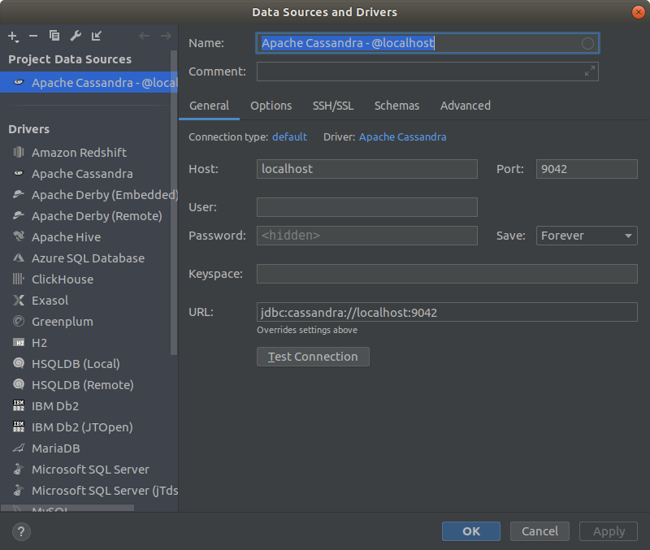
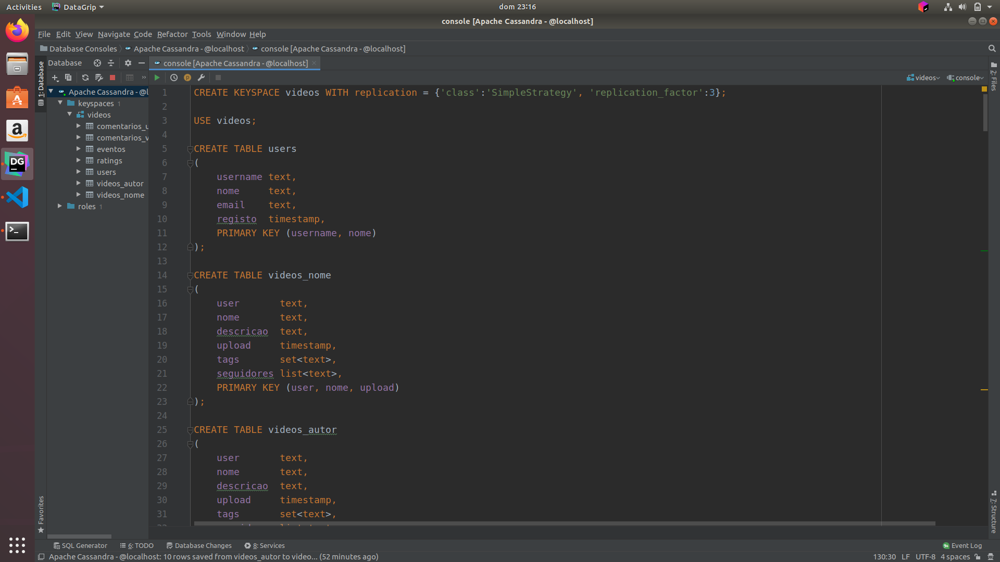

# Cassandra

## Setup
Para a realização optei à semelhança do guião de Mongo por correr uma instância de docker e aceder ao mesmo através do Data Grip.

### Install cassandra
**Nota:** Pressupõe uma instalação de docker já feita.

```bash
$ docker pull cassandra
$ docker run -d -p 9042:9042 cassandra:latest
```

